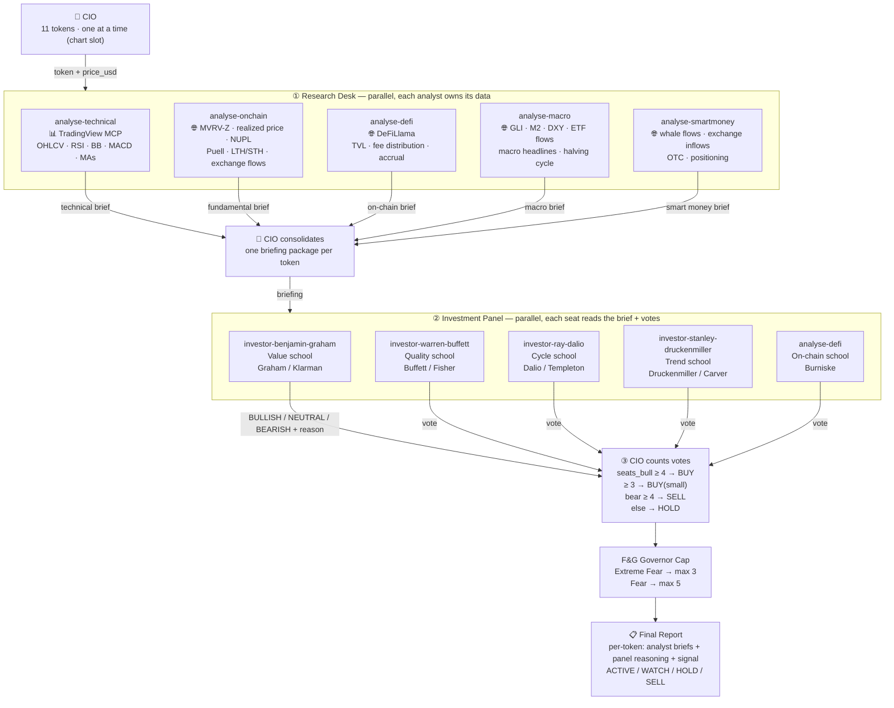

# crypto-advisor

Multi-token crypto portfolio analyzer. Runs a **3-layer hedge fund structure** (Research → Panel → Report) per token and outputs BUY / BUY(small) / HOLD / SELL signals with a F&G-governed position cap.

> Educational only. Not financial advice. No leverage. Ever.

## Architecture



## Layers

### Layer 1 — Research Desk (data gatherers, no votes)

| Analyst | Skill | Data source |
|---|---|---|
| Technical | [`analyse-technical`](../analyse-technical/SKILL.md) | TradingView MCP — OHLCV, RSI, BB, MACD, MAs |
| BTC valuation | [`analyse-onchain`](../analyse-onchain/SKILL.md) | MVRV-Z, realized price, NUPL, Puell, LTH/STH supply, exchange flows |
| On-chain DeFi | [`analyse-defi`](../analyse-defi/SKILL.md) | DeFiLlama: TVL, fee distribution, protocol accrual |
| Macro | [`analyse-macro`](../analyse-macro/SKILL.md) | GLI, M2, DXY, ETF flows, halving cycle, macro headlines |
| Smart money | [`analyse-smartmoney`](../analyse-smartmoney/SKILL.md) | Whale flows, exchange inflows/outflows, OTC desk, positioning |

> **`analyse-onchain` vs `analyse-defi` — two layers of "on-chain", different assets.** `analyse-onchain` reads the cost-basis and holder behavior of a monetary asset (BTC/ETH/SOL); `analyse-defi` reads protocol fundamentals of a DeFi token (AAVE/UNI/JUP/AERO…). They are complementary seats, not duplicates.
>
> | | `analyse-onchain` | `analyse-defi` |
> |---|---|---|
> | **Question** | "Is **BTC** cheap or expensive in its cycle?" | "Does **this protocol's token** capture real value?" |
> | **Asset** | Bitcoin / L1 monetary assets | DeFi protocol tokens |
> | **Framework** | Cycle/valuation — MVRV-Z, NUPL, realized price, Puell, LTH/STH, exchange flows | Burniske value-accrual — revenue, TVL, fee distribution |
> | **Data source** | `crypto-onchain-data` (Glassnode/CryptoQuant style) | DeFiLlama |
> | **Output** | Zone verdict (DEEP VALUE → EXTREME) + confidence | BULLISH / NEUTRAL / BEARISH vote + reason |

### Layer 2 — Investment Panel (read briefing, vote per school)

| Seat | Skill | School |
|---|---|---|
| Value | [`investor-benjamin-graham`](../investor-benjamin-graham/SKILL.md) | Graham (*The Intelligent Investor* ch.20) / Klarman |
| Quality | [`investor-warren-buffett`](../investor-warren-buffett/SKILL.md) | Buffett / Fisher (*Common Stocks and Uncommon Profits*) |
| Cycle | [`investor-ray-dalio`](../investor-ray-dalio/SKILL.md) | Dalio / Templeton ("maximum pessimism") |
| Trend | [`investor-stanley-druckenmiller`](../investor-stanley-druckenmiller/SKILL.md) | Druckenmiller / Carver (*Systematic Trading*) |
| On-chain | [`analyse-defi`](../analyse-defi/SKILL.md) | Burniske (*Cryptoassets* value-accrual) — dual role: research + vote |

### Layer 3 — CIO (vote count → signal → governor → report)

## Signal table

```
seats_bear ≥ 4   → SELL
seats_bull ≥ 4   → BUY
seats_bull ≥ 3   → BUY(small)
else             → HOLD
```

## Governor cap

| F&G regime | Max simultaneous active buys |
|---|---|
| Extreme Fear (0–24) | 3 |
| Fear (25–49) | 5 |
| Neutral+ (50–100) | no cap |

Rank by seats_bull DESC, downgrade lowest-conviction buys to WATCH.

## Token universe

BTC · ETH · SOL · TON · HYPE · AAVE · JUP · UNI · AERO · PUMP · LINK

## Related docs

- [`docs/crypto-advisor-panel.prd.md`](../../docs/crypto-advisor-panel.prd.md) — design rationale, school citations
- [`docs/crypto-advisor-panel.tdd.md`](../../docs/crypto-advisor-panel.tdd.md) — data contracts, runtime adapters
- [`SKILL.md`](SKILL.md) — full orchestration instructions for the agent
