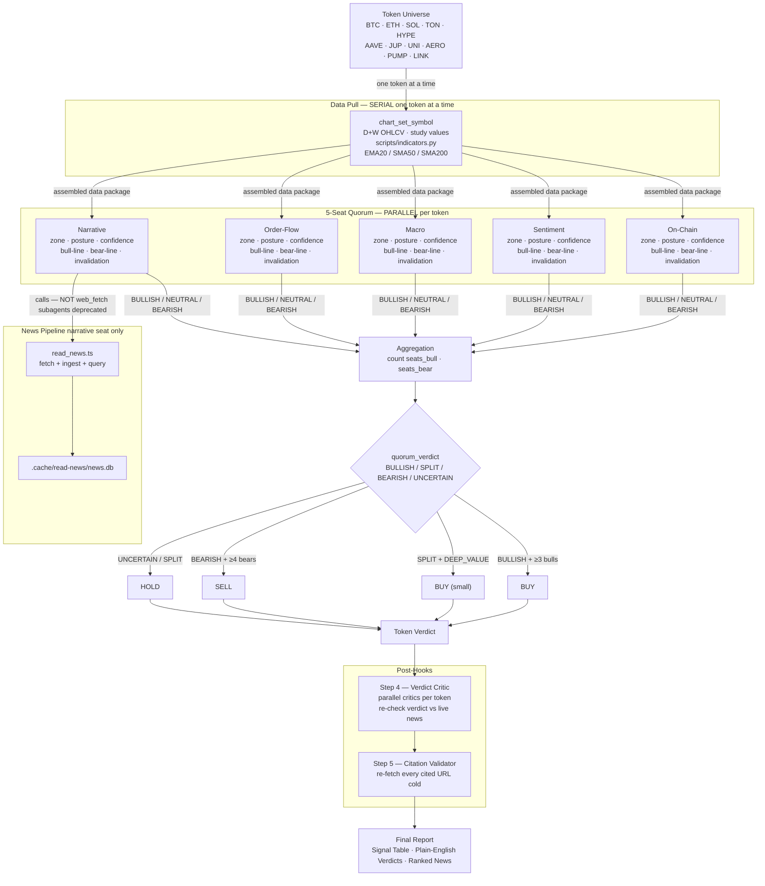

# Crypto Advisor

Analyze every token in the universe **sequentially** → decide BUY/SELL/HOLD per token → print the signal table.

> Educational analysis, not financial advice. No leverage. Ever.

## Quickstart

### Default daily run
```
Run the crypto advisor
```
The skill analyzes the default token universe, pulls live TradingView data, runs a 5-seat quorum per token, and prints the full 3-block report (signal table + plain-English verdicts + ranked news sources). **Attach a TradingView screenshot for each token.**

### Custom token set
```
Run the crypto advisor on: TON, JUP, HYPE
```

### Full prompt (copy-paste for any session)
```
Invoke the crypto-advisor skill. Token universe for this run: [TOKEN1, TOKEN2, ...].
Follow all skill instructions:
- chart_get_state → dedup indicators → set_symbol → D OHLCV (365 summary + 210 bars) → study values → W OHLCV → capture_screenshot
- Compute MAs via .agents/skills/crypto-advisor/scripts/indicators.py
- Run 5-seat quorum inline (on-chain, sentiment, macro, order-flow, narrative)
- Narrative seat: web-fetch ≥3 sources, rank T1/T2/T3, quote exact sentences
- Print 3-block report: signal table | plain-English verdicts | news sources
- Attach TradingView screenshot for each token in the reply
Educational, not financial advice.
```

### Scheduling (continuous)
```
/loop interval=6h    ← re-runs every 6 hours, resumes from last pending todo
/stop                ← cancel the loop
```

---

## Token universe

**⛔ STALENESS RULE — applies to every row in this table:**
> Any claim about token mechanics (fee switch, buyback, burn, staking yield, revenue accrual, governance status) is a **live fact that can change via governance vote at any time**. It MUST be verified by a live `web_fetch` before being used as evidence in a quorum verdict or a removal/addition decision. Never write or rely on a tokenomics claim from memory alone — the UNI error (fee switch described as "perpetually failed" when it had passed 6 months earlier) is the canonical example of why.
>
> **Verify protocol mechanics before using them:**
> 1. `web_fetch https://defillama.com/protocol/{slug}` → check Protocol Revenue row (non-zero = fee capture exists)
> 2. `web_fetch https://www.theblock.co/search?query={token}+fee+switch` → check for recent governance votes
> 3. If DeFiLlama shows revenue AND you recall "no fee accrual" → you are stale. Fetch the governance forum before concluding.

| Token | Rationale (verified 2026-06-23) | TradingView symbol |
|-------|--------------------------------|-------------------|
| BTC   | Foundational monetary layer; largest market cap | `BINANCE:BTCUSDT` |
| ETH   | Smart-contract platform; stablecoin infra (53% of $300B market) | `BINANCE:ETHUSDT` |
| SOL   | High-performance L1; Solana DeFi base layer | `BINANCE:SOLUSDT` |
| TON   | Telegram L1; 900M-user payment infra (Wallet + USDT); watch Durov legal status | `BINANCE:TONUSDT` |
| HYPE  | Hyperliquid perp DEX; 97% revenue auto-buyback hardcoded; real cashflow token | `OKX:HYPEUSDT` |
| AAVE  | Leading DeFi lending protocol; real yield from spreads + GHO fees; >$1T cumulative loans | `BINANCE:AAVEUSDT` |
| JUP   | Jupiter — Solana DeFi super-app (perps, lending, launchpad, DCA, staking); 15+ fee streams | `BINANCE:JUPUSDT` |
| UNI   | Uniswap — fee switch activated Dec 2025 (UNIfication, 99.9% vote); trading fees → burn UNI via Firepit; 100M burned at launch; $1B+/yr fee base; expanding to all v3 + 8 chains [verified: theblock.co/post/383742] | `BINANCE:UNIUSDT` |
| AERO  | Aerodrome Finance — Base chain DEX; real trading fees; ve(3,3) tokenomics with revenue accrual | `BINANCE:AEROUSDT` |
| PUMP  | Pump.fun — Solana meme launchpad; reflexive fees; track for cycle timing signal | `OKX:PUMPUSDT` |
| LINK  | Oracle network; backbone of RWA tokenization (Swift, Euroclear, JPMorgan, UBS) | `BINANCE:LINKUSDT` |

---

## Hard constraints — read before running (these dictate the whole design)

1. **TradingView MCP tools live ONLY in the orchestrator (you).** Subagents spawned via the task tool get a fresh toolset with **no** `tradingview-*` tools — verified. So **YOU** must pull every chart datum yourself. Never tell a subagent to "pull TradingView data" — it cannot. Subagents may only *receive* an already-assembled data package and reason over it (they can still web-fetch F&G / on-chain).
2. **The chart is a single shared symbol slot.** `chart_set_symbol` changes the one global chart, so two tokens cannot be pulled at once. **Therefore the data loop is strictly sequential, one token at a time.** Track progress in the `todos` table so a `/loop` or an interrupted run resumes cleanly.
3. **Read every indicator TradingView can give from TradingView — don't recompute it.** `data_get_study_values` returns RSI(14), Bollinger(20,2), MACD(12,26,9) and Volume correctly at their standard lengths. Use those values verbatim. The **only** gap is moving averages: `chart_manage_indicator` ignores the MA `length` input (an added MA exposes `inputs:[]` and stays stuck at a short default ≈ price; verified BTC read $64,540 when SMA200 was ~$76,600) and has no `update` action. So EMA20 / SMA50 / SMA200 / 200-week-MA — and only those — are computed by `scripts/indicators.py` from the MCP's **own** returned closes (plain rolling means / EWMs; the data source stays 100% TradingView).

TradingView symbol mapping: `BINANCE:{TOKEN}USDT` (e.g. `BINANCE:BTCUSDT`). If a symbol is missing on Binance, try `OKX:{TOKEN}USDT`.

---

## Step 0 — Seed the todo list (one row per token)

```sql
INSERT INTO todos (id, title, description) VALUES
 ('tok-BTC', 'Analyzing BTC',  'Pull TradingView D/W OHLCV+studies, compute pkg, run 5-seat quorum, decide signal'),
 ('tok-ETH', 'Analyzing ETH',  'idem'),
 ('tok-SOL', 'Analyzing SOL',  'idem'),
 ('tok-TON', 'Analyzing TON',  'idem — watch Durov legal proceedings'),
 ('tok-HYPE','Analyzing HYPE', 'idem — use OKX:HYPEUSDT'),
 ('tok-AAVE','Analyzing AAVE', 'idem'),
 ('tok-JUP', 'Analyzing JUP',  'idem — Jupiter Solana DeFi super-app'),
 ('tok-UNI', 'Analyzing UNI',  'idem — fee switch live Dec 2025; burns via Firepit; $1B+/yr fee base'),
 ('tok-AERO','Analyzing AERO', 'idem — Aerodrome Finance Base DEX, try BINANCE:AEROUSDT'),
 ('tok-PUMP','Analyzing PUMP', 'idem — pump.fun token, try OKX:PUMPUSDT'),
 ('tok-LINK','Analyzing LINK', 'idem');
```

Create the verdict tracker once:

```sql
CREATE TABLE IF NOT EXISTS token_analysis (
  symbol TEXT PRIMARY KEY, quorum_verdict TEXT, dominant_zone TEXT,
  seats_bull INTEGER, seats_bear INTEGER, key_support REAL, key_resistance REAL,
  confidence TEXT, signal TEXT, status TEXT DEFAULT 'pending');
```

---

## Step 1 — Sequential per-token loop (orchestrator does this; do NOT parallelize the data pull)

Pick the next `pending` todo and `UPDATE todos SET status='in_progress'`. Then, for that token:

**1a. Pull TradingView data (MCP, in this session):**

First, call `tradingview-chart_get_state` and inspect the `studies` list.  
**Only add an indicator if its name is NOT already present** — adding a duplicate pushes a second identical series onto the chart, inflates context, and produces duplicate rows in `data_get_study_values`. Use `chart_manage_indicator action=remove` on the extra entity_id if duplicates already exist.

Required studies (add only if absent): **Relative Strength Index**, **Bollinger Bands**, **MACD**. Do NOT add length-N EMAs — the length input is ignored (constraint 3). Volume is always present.

```
tradingview-chart_get_state                                → inspect studies list; deduplicate before proceeding
tradingview-chart_set_symbol     symbol="BINANCE:{TOKEN}USDT"
tradingview-chart_set_timeframe  timeframe="D"
tradingview-data_get_ohlcv       count=365 summary=true   → 52w high/low + avg volume
tradingview-data_get_ohlcv       count=210 summary=false  → >=200 daily closes (for SMA200)
tradingview-data_get_study_values                          → RSI(14), BB(20,2), MACD, Volume (one of each)
tradingview-chart_set_timeframe  timeframe="W"
tradingview-data_get_ohlcv       count=210 summary=false  → weekly closes (for 200-week MA)
tradingview-chart_set_timeframe  timeframe="D"             → reset to daily
tradingview-capture_screenshot                             → save screenshot; then call view tool on the returned file_path to embed the image inline in your reply for this token
```

**1b. Read the indicators from TradingView; compute only the moving averages.** From `data_get_study_values` take RSI(14), Bollinger(20,2), MACD line/signal/hist, Volume — verbatim, no recompute. From the daily `summary=true` pull take 52w high/low + avg volume. Then fill the MA gap (computed MAs match TradingView's own values):
```bash
/Users/engineer/.venv/bin/python3 .agents/skills/crypto-advisor/scripts/indicators.py /tmp/{TOKEN}.json
```
Helper input: `{"symbol","price","daily_closes":[...],"weekly_closes":[...]}`. Helper output: EMA20, SMA50, SMA200, 200-week MA, and the death cross (classic SMA50/SMA200, exact). Nothing else — it does not recompute RSI/BB/MACD.

**⛔ DATA SUFFICIENCY GATE — run before zone classification:**
Count the number of weekly closes returned by `tradingview-data_get_ohlcv count=210 timeframe=W`.
- If `weekly_closes < 200`: set `200wMA = INSUFFICIENT`, `dominant_zone = UNKNOWN`.
- Zone `UNKNOWN` **blocks** BUY and BUY(small) — signal must be HOLD until sufficient history is available.
- Rationale: 365 days of daily data ≈ 52 weekly closes; 200-week MA requires ~4 years (~200 weekly closes) to be valid. Reporting a 200wMA from 52 weekly closes is mathematically meaningless and produces fabricated zone signals.
- If TradingView fallback was used (e.g. coingecko prices), tag every MA field: `[fallback: coingecko]`.

**1c. Assemble the data package** by merging the TradingView study values (RSI, BB, MACD, Volume, 52w hi/lo) with the helper's moving-average block: price, %from-52wh, EMA20, SMA50, SMA200, death_cross, RSI, MACD line/signal/hist, BB upper/mid/lower + position, volume vs 30d avg, 200-week MA + %vs it.

**1d. Run the 5-seat quorum on the package.** Either reason through the 5 seats inline, or spawn the five `analysis-*` seat subagents **in parallel** (on-chain, sentiment, macro, order-flow, narrative) with the package **injected** — seats per token may be parallel because they share nothing; only the *data pull* must be serial. Each seat returns: zone, posture (BULLISH|NEUTRAL|BEARISH), confidence, 1-line bull, 1-line bear, invalidation.

**On-chain seat — mandatory tokenomics live check for DeFi tokens.**

For any non-L1 token (not BTC/ETH/SOL/TON), you MUST verify protocol mechanics via live fetch before the on-chain verdict. This is the **UNI rule** — named after the error where "no fee accrual" was stated confidently from stale memory when the fee switch had already passed 6 months earlier.

**⛔ NEVER state a tokenomics claim (fee switch, buyback, burn, staking yield, revenue accrual) from memory.** Governance votes can change protocol economics at any time. A claim that was true 3 months ago may be false today.

**Steps (do these before writing the on-chain verdict for any DeFi token):**

1. `web_fetch https://defillama.com/protocol/{slug}` (e.g. `uniswap`, `aave`, `aerodrome`)
   - Look for: **Protocol Revenue** row. Non-zero = fee capture mechanism exists somewhere — investigate further even if you "know" the token has none.
   - Look for: **Token burns**, **buybacks**, **revenue distribution** in the description.

2. If DeFiLlama shows non-zero revenue AND your recalled knowledge says "no accrual" → **you are stale**. Do not use the recalled knowledge. Fetch the governance forum:
   - `web_fetch https://www.theblock.co/search?query={TOKEN}+fee+switch`
   - `web_fetch https://gov.uniswap.org` (or equivalent protocol forum)

3. Only after the live fetch can you characterize the token mechanics in the verdict. Quote the fetched source verbatim; cite the URL.

**Narrative seat — mandatory sourcing protocol.**

**⛔ HARD RULE: You MUST call `web_fetch` on a real URL before you can cite it as a source — OR cite a record printed by the feed scripts (`feeds/wsj.ts`/`feeds/ft.ts`/`read_news.ts`), which return real URLs + verbatim publisher teasers. If you neither `web_fetch`ed the URL nor got it from a feed script this run, it is NOT a source — do not write it down. A fabricated headline with no URL is a hallucination and invalidates the entire narrative verdict.**

**Step-by-step (do this in order, do not skip):**

> ⚠️ **Known broken sources (do NOT use)**:
> - `coindesk.com/search?q=...` — always returns the same unrelated featured article regardless of query. Never use search URLs.
> - `decrypt.co/tag/...` — 404 for most tokens.
> - `cryptopanic.com/news/...` — returns only page title, no articles.
> Use the **two-step discovery pattern** for news: (1) fetch a listing page to get current article URLs, (2) fetch the actual article URL for the quote.

1. **Call `web_fetch` on at least 3 of these starting URLs** for the token. Pick the most relevant:

   **On-chain data (T1 — always try first):**
   - Fear & Greed: `https://api.alternative.me/fng/?limit=1` (JSON — hard T1)
   - DeFiLlama chain page: `https://defillama.com/chain/ethereum` | `https://defillama.com/chain/solana` etc. (T1 — TVL, fees, revenue)
   - DeFiLlama protocol page: `https://defillama.com/protocol/{token-slug}` e.g. `aave`, `uniswap`, `chainlink` (T1)

   **News discovery — two-step (T2):**
   - Step 1: fetch the **listing page** to get current article URLs:
     - `https://www.coindesk.com/markets` → BTC/ETH price/macro news
     - `https://www.coindesk.com/tech` → DeFi/protocol news
     - `https://www.theblock.co/latest` → broad crypto news
   - Step 2: from the listing page response, extract any article URL relevant to the token (e.g. `https://www.coindesk.com/markets/2026/06/21/bitcoin-holds-near-...`), then **fetch that article URL** and quote from its body. The article URL — not the listing page — is what you cite in Block 3.

   **Macro context — FT/WSJ via paywall-free feed scripts (T2, for BTC/ETH & risk regime):**
   Mainstream macro coverage (Fed, rates, liquidity, ETF flows, dollar) moves crypto but FT/WSJ are
   paywalled/bot-blocked — do NOT web_fetch their listing pages. Instead run the feed scripts; each prints
   real `wsj.com`/`ft.com` URLs + a verbatim 1-sentence publisher teaser + date (the teaser IS a citable
   quote — use it as a T2 source without needing the paywalled body). NOTE: `--query` is AND-of-words, so
   keep it to ONE topic word (e.g. `bitcoin`, `Fed`, `crypto`) or omit it and skim the top markets items:
   ```bash
   bun .agents/skills/read-news/scripts/feeds/wsj.ts --feed markets --days 5 --limit 20 --text          # top markets/macro
   bun .agents/skills/read-news/scripts/feeds/ft.ts  --section markets,global-economy --query bitcoin --days 5 --text
   ```
   For a broader consolidated crypto+macro event feed (deduped across all outlets), use [[narrative-news]]:
   `bun .agents/skills/read-news/scripts/read_news.ts --db .cache/read-news/news.db --days 5 --query "<token/theme>"`.

2. **Read what actually came back.** If the fetch returns an error or no relevant content, write `[FETCH FAILED: <url>]` — do NOT count it toward the 3-source minimum, do NOT invent what it "would have said."

3. **Quote verbatim** — copy an exact sentence or number from the page. Do not paraphrase from memory.

4. **Rank sources by signal quality:**
   - **Tier 1 — Primary signal**: on-chain/flow data with timestamps and hard numbers (ETF flow $, protocol revenue $, F&G index value). Weight: 3×. Drives posture.
   - **Tier 2 — Credible context**: Bloomberg/Reuters/FT/WSJ/CoinDesk/TheBlock with named sources and specific claims. Weight: 2×. Supports posture.
   - **Tier 3 — Noise/sentiment gauge**: social media, "analysts say", recycled press releases. Weight: 0.5×. Informs sentiment only, never drives posture verdict.

5. **Show the ranking reason** for each: one sentence (e.g. "T1: F&G returned value=18 with timestamp — hard data point directly measuring market fear").

6. **State the invalidation anchor**: what would reverse this verdict if the evidence were opposite.

Narrative seat output format (inline, per token):
```
NARRATIVE — {TOKEN}
Posture: BULLISH | NEUTRAL | BEARISH
Sources fetched (ranked):
  [T1] https://<actual-url-you-called-web_fetch-on> — "<verbatim quote from page>" → T1 because: <one sentence>
  [T2] https://<actual-url-you-called-web_fetch-on> — "<verbatim quote from page>" → T2 because: <one sentence>
  [T3] https://<actual-url-you-called-web_fetch-on> — "<verbatim quote from page>" → T3 because: <one sentence>
  [FETCH FAILED: https://...] — not counted
Bull: <1-line>
Bear: <1-line>
Invalidation: <what reverses this verdict>
```

**If you have fewer than 2 successfully fetched sources after trying all applicable URLs above, set posture = NEUTRAL and note "INSUFFICIENT DATA" — do not guess.**

**1e. Aggregate into the compact verdict and persist:**
```json
{"symbol":"BTC","quorum_verdict":"BULLISH|SPLIT|BEARISH|UNCERTAIN",
 "dominant_zone":"DEEP_VALUE|FAIR_VALUE|ELEVATED|EXTREME|UNKNOWN",
 "seats_bull":3,"seats_bear":2,"key_support":60000,"key_resistance":66000,"confidence":"HIGH|MED|LOW"}
```
```sql
UPDATE token_analysis SET quorum_verdict=?, dominant_zone=?, seats_bull=?, seats_bear=?,
  key_support=?, key_resistance=?, confidence=?, signal=?, status='done' WHERE symbol=?;
UPDATE todos SET status='done' WHERE id='tok-{TOKEN}';
```

**1f. Repeat** for the next `pending` todo until none remain.

---

## quorum_verdict mapping (deterministic)

Map seat postures to `quorum_verdict` using this truth table — no interpretation, no judgment:

| seats_bull | seats_bear | quorum_verdict |
|------------|------------|----------------|
| ≥ 3        | ≤ 1        | BULLISH        |
| ≥ 3        | ≥ 2        | SPLIT          |
| 2          | ≤ 1        | SPLIT          |
| ≤ 1        | ≥ 3        | BEARISH        |
| everything else       | UNCERTAIN  |

(seats_bull + seats_bear ≤ 5; NEUTRAL seats count toward neither.)

---

## Step 2 — Decide per token

| Signal | Condition |
|---|---|
| **BUY** | `quorum_verdict = BULLISH`, seats_bull ≥ 3, `dominant_zone ∈ {DEEP_VALUE, FAIR_VALUE}` |
| **BUY\*** | `quorum_verdict = BULLISH`, seats_bull ≥ 3, `dominant_zone = ELEVATED` → downgrade to **HOLD** + note "await pullback" |
| **BUY\*\*** | `quorum_verdict = BULLISH`, seats_bull ≥ 3, `dominant_zone = EXTREME` → downgrade to **HOLD** + note "extended, avoid" |
| **BUY (small)** | `quorum_verdict = SPLIT`, `dominant_zone = DEEP_VALUE` |
| **SELL** | `quorum_verdict = BEARISH`, seats_bear ≥ 4 |
| **HOLD** | everything else (including `dominant_zone = UNKNOWN`) |

## Portfolio Governor — regime-aware buy cap

Before finalising signals, count total BUY + BUY(small) signals across all tokens. Apply regime cap based on the Fear & Greed index fetched during the run:

| Regime (F&G)          | Max simultaneous BUYs |
|-----------------------|-----------------------|
| Extreme Fear (0–24)   | 4                     |
| Fear (25–49)          | 6                     |
| Neutral+ (50–100)     | no cap                |

**Always perform these steps in order — even when no downgrades fire:**

1. **Rank all BUY/BUY(small) signals by conviction** (ascending): sort by `seats_bull` ascending, then by `confidence` ascending (MED < HIGH). Print the ranked list.
2. **Count total BUYs** and compare to the regime cap.
3. **If total > cap**: downgrade from the bottom of the ranked list (lowest conviction first) until the cap is met. Print: `⚠️ Governor: {n} BUY(s) downgraded to HOLD (regime cap F&G={value})`.
4. **If total ≤ cap**: no downgrades. Print: `✅ Governor: {total} BUY(s) within cap of {cap} (regime: {regime_name}, F&G={value})`.

> Format note: `{total}` is the INTEGER COUNT of BUY + BUY(small) tokens. `BUY(s)` is a fixed label — do NOT substitute the specific signal subtype (e.g. do not write "BUY(small)(s)" or "1 BUY(small) within cap"). Always write `N BUY(s)` regardless of whether signals are BUY or BUY(small).

This explicit ranking step is mandatory regardless of outcome — it makes the downgrade logic auditable and catches upstream signal errors (e.g., a token scored BUY(small) despite quorum=UNCERTAIN).

Rationale: in a Fear regime the risk-reward of concentrated buying is poor; the governor enforces the "60–70% dry powder" discipline that a pure signal table cannot.

---

**WAIT / HOLD with a named buy-zone** (e.g. "not now, but buy AAVE near $73") → register a
notify-me job carrying your thesis via the **`mkt`** skill, so the user is pinged when the
price/RSI/MACD level hits. See *Set a buy-alert* below.

## Step 3 — Print the full run report

**Always start the report with a 2–3 sentence exec recap** before Block 1. No headers — just plain text. Format:

```
{High-conviction signal}: {TOKEN} — {1-line reason why: key indicator + zone + quorum}.
{Second signal if exists, else skip}.
Narrative: {1 sentence on the dominant market theme right now — regime, macro driver, what's moving the space}.
```

Rules:
- Lead with the highest-conviction BUY or SELL (most seats, clearest zone). Skip if nothing above HOLD.
- If all signals are HOLD, say so in one sentence + the dominant reason (e.g. "All 11 tokens HOLD — trend bearish, waiting for 200wMA reclaim").
- The narrative sentence must be grounded in a fetched source from this run. No URL = no claim.
- Keep it under 3 sentences total. Not a list — flowing text.

Example:
```
HIGH-CONVICTION BUY: AAVE — 4/5 seats bullish, zone=DEEP_VALUE (RSI 23, −62% from ATH, above 200wMA support at $62). BUY(small): LINK on RWA tailwind (Swift/Euroclear pipeline live). Narrative: Extreme Fear (F&G 18) — AI/tech macro selloff hit crypto hard this week; quality DeFi is at cycle-floor valuations while fundamentals (TVL, fees) held.
```

Print **three blocks** after the exec recap, in this exact order:

### Block 1 — Signal table (one-glance summary)
```
=== CRYPTO PORTFOLIO RUN — {timestamp} ===   (data: TradingView MCP)

Token | Signal      | Zone       | Quorum | Bulls/Bears
------|-------------|------------|--------|------------
BTC   | HOLD        | FAIR_VALUE | SPLIT  | 2 / 2
ETH   | BUY (small) | DEEP_VALUE | SPLIT  | 1 / 2
SOL   | BUY (small) | DEEP_VALUE | SPLIT  | 3 / 1
...
```

### Block 2 — Plain-English verdict per token
For every token write 3–5 sentences a non-expert can understand. Cover:
- **Why this signal**: what 1–2 facts drove the decision (price vs 200w MA, RSI, death cross, on-chain zone).
- **News catalyst** (if any): state the headline fact **and** append `[source: https://exact-article-url]` inline — no URL = do not mention the fact.
- **Main risk**: the single biggest thing that could make this call wrong.
- **What to watch**: the one trigger that would change the signal (e.g. "close above SMA50" → HOLD flips to BUY).

**⛔ HARD RULE for Block 2:** Every claim that comes from a fetched article, data feed, or external source MUST have an inline `[source: https://...]` immediately after it. Technical indicators (RSI, MACD, death cross) computed from price data do NOT need a source. Narrative facts (headlines, protocol TVL, fund flows, institutional events) DO. A claim with no `[source:]` tag is treated as unverified and must be removed.

Example:
```
BTC — HOLD
BTC is down 42% from its all-time high and sits on the 200-week moving average
(~$62k), the historical long-term floor. RSI has recovered to neutral (42.6)
and MACD is turning up. However a death cross is active (50-day below 200-day),
macro is hostile (Fed holding rates, strong dollar), and ETF flows are still
negative [source: https://www.coindesk.com/markets/2026/06/21/btc-etf-outflows].
Not cheap enough on-chain to force a buy, not broken enough to sell.
Watch for a daily close above SMA50 ($71.9k) to upgrade to BUY,
or a weekly close below $60k to reassess.

ETH — BUY (small)
ETH has crashed 63% from its 52-week high and is now 30% below its 200-week
moving average — a level historically associated with cycle bottoms. The
Ethereum Foundation cut 20% of its workforce today as part of a restructuring
[source: https://www.theblock.co/post/405809/ethereum-foundation-cuts-20-of-its-workforce-as-new-5-cluster-structure-takes-shape],
adding organizational risk on top of the macro headwinds. One panel seat is
bullish (on-chain deep value), two are bearish (macro + EF uncertainty).
The split verdict with extreme undervaluation triggers the "small position"
rule: start a toe-hold, don't go large.
Key risk: ETH/BTC continues compressing if L2 fee erosion persists.
Upgrade to BUY if price reclaims the 200-week MA (~$2,472).
```

### Block 3 — News & sources used by the Narrative seat
List every URL the narrative seat fetched, with a one-line plain-English
summary of what it said and why it was ranked T1/T2/T3.

```
--- NEWS SOURCES ---
(Only URLs you actually called web_fetch on — or that a feed script (feeds/wsj.ts/feeds/ft.ts/
read_news.ts) returned — appear here. No URL = no entry.
Every entry MUST start with https:// — source name alone is NOT acceptable.)

BTC narrative (posture: BEARISH)
  [T1] https://api.alternative.me/fng/?limit=1 — "value: 18, value_classification: Extreme Fear" → T1: hard numeric index with timestamp, directly measures crowd fear
  [T2] https://www.coindesk.com/markets/2026/06/21/bitcoin-options-traders-scrambling → "Bitcoin traders are scrambling to buy options bets that would pay off if the selloff deepens" → T2: named-source journalism, live positioning data
  [T3] https://www.coindesk.com/markets/2026/06/20/bitcoin-54k-analyst-forecast → "Bitcoin price may be headed to $54,000, says analyst who forecast October's all-time high" → T3: analyst opinion, useful for risk framing, no hard data
  [FETCH FAILED: https://www.theblock.co/latest] — no BTC-specific articles visible

ETH narrative (posture: BULLISH)
  [T1] https://defillama.com/chain/ethereum — "Chain Revenue (24h)$65,225... App Revenue (24h)$1.1m... Bridged TVL$349.351b" → T1: primary on-chain metrics with exact daily figures
  [T2] https://www.coindesk.com/tech/2026/06/21/ethereum-staking-update → "SharpLink Gaming adds ETH to treasury" → T2: credible source, specific catalyst
  [FETCH FAILED: https://defillama.com/protocol/lido] — returned only funding rounds, no TVL data
```

> ⚠️ Wrong (never do this):
> ```
> T1 — CoinDesk
> Quote: "Bitcoin traders are scrambling..."
> ```
> Wrong because: no `https://` URL, no actual article link. Source name alone = hallucination risk.
>
> Right:
> ```
> [T1] https://www.coindesk.com/markets/2026/06/21/bitcoin-options-traders-... — "Bitcoin traders are scrambling..."
> ```

Self-check before printing:
- Every token has `status='done'` in `token_analysis`
- `seats_bull + seats_bear <= 5` for each token
- Every narrative source entry starts with `https://` followed by the **specific article URL** (not a listing/search page) — if any entry has only a source name or no URL, remove it and mark INSUFFICIENT DATA
- **Two-step verified**: news citations point to the article URL you fetched (step 2), not the listing page (step 1)
- **Block 2 inline links**: every news-based claim in Block 2 has `[source: https://...]` — scan each verdict and confirm; remove any fact that has no source tag
- A TradingView screenshot is embedded inline (via `view` tool on the `file_path`) for every token — not just captured, but visible
- **No source may be cited that was not actually fetched this run** — verify: "did I call web_fetch on this exact URL, or did a feed script return it?" If neither, remove it

---

## Step 4 — Verdict Critic (post-hook: substance check)

**Run this before printing Block 1.** For every token, a fresh subagent — with no memory of the quorum analysis — reads today's news and challenges the verdict. This catches the class of error where a verdict is technically consistent with the data package but contradicts something happening in the real world right now.

> **Why this step exists:** The UNI error. The quorum produced "no fee accrual" with confidence because the data package didn't contradict it. A fresh agent reading TheBlock for 60 seconds would have seen "UNIfication passes 99.9% — fee switch activated". No further reasoning required. The error was not in the quorum logic — it was in the absence of a live news check before accepting the verdict.

**4a. For **every token** (not just flagged ones), spawn a verdict-critic subagent in parallel.** ⛔ All tokens must be covered — partial coverage is INCOMPLETE. Pass it:
- Token symbol and the full quorum verdict text (signal, zone, quorum, all 5 seat postures, key claims)
- The following instructions:

```
You are a devil's advocate critic. Your job is to find problems with this verdict, not confirm it.
You have NO prior knowledge of this analysis run — start fresh.

Token: {TOKEN}
Verdict to critique:
{paste full quorum verdict block}

Your task:
1. Fetch these two URLs and read what comes back:
   a. web_fetch https://www.theblock.co/search?query={TOKEN}+crypto (recent news listing)
   b. web_fetch the most relevant article URL from (a) — pick the one most likely to challenge the verdict
   c. web_fetch https://defillama.com/protocol/{slug} (protocol metrics and revenue)

2. Challenge the verdict with these four questions. Answer each one:
   Q1 DIRECTION: Does today's news point in the OPPOSITE direction from the signal?
      (e.g. verdict=BEARISH but news says "protocol launches major feature, TVL up 40%")
   Q2 STALE MECHANICS: Does the verdict make any categorical claim about protocol mechanics
      (fee switch, buyback, burn, revenue accrual, governance status) that the news or DeFiLlama contradicts?
      Red-flag phrases: "no fee accrual", "governance only", "no buyback", "fees go to LPs only",
      "fee switch pending", "never passed". Any of these = verify against live data.
   Q3 MISSING CATALYST: Is there a major event in the news (governance vote passed, exploit,
      institutional adoption, regulatory decision, partnership) that the verdict completely ignores?
   Q4 OVERCONFIDENCE: Does the verdict use absolute language ("permanently", "structurally",
      "will never", "always has been") about something that governance or market conditions could change?

3. Return this exact format:

CRITIC — {TOKEN}
News fetched:
  [1] https://<url-you-fetched> — "<verbatim quote from page>"
  [2] https://<url-you-fetched> — "<verbatim quote from page>"
  [3] https://<defillama-url> — "<protocol revenue or description quote>"

Q1 DIRECTION:   PASS | FLAG — <one sentence>
Q2 STALE MECH:  PASS | FLAG — <one sentence, cite the specific claim and the contradicting evidence>
Q3 MISSING:     PASS | FLAG — <one sentence, cite the missing event and its URL>
Q4 OVERCONF:    PASS | FLAG — <quote the overconfident phrase>

OVERALL: PASS | FLAG
If FLAG: "<specific verdict text that must be corrected> → correct to: <corrected claim with source URL>"
```

**4b. Print all critic reports** for all tokens in sequence.

**4c. Act on FLAGs before printing Block 1:**
- `OVERALL: FLAG` on any token → **revise that token's quorum verdict** to address the specific critique, re-run the signal decision for that token, and mark it `⚠️ REVISED` in Block 1.
- `OVERALL: PASS` on all tokens → print `✅ Verdict Critic: {n}/{total} tokens reviewed` where `n` must equal `total` (total = count of tokens in the universe this run). ⛔ If n < total, the run is INCOMPLETE — do not proceed to Block 1.

> The critic cannot access TradingView tools — only `web_fetch`. That is intentional: it reads the world, not the chart. Technical signals are the quorum's job; the critic's only job is "does today's news contradict this?"

---

## Step 5 — Citation validation (post-hook: format check)

After printing Block 3, run the `reference-validator` post-hook to verify every source cited in the narrative seats is real.

**5a. Assemble the citations JSON** — collect every `[T1]`, `[T2]`, `[T3]` entry from Block 3 that has a real `https://` URL (skip `[FETCH FAILED]` entries — those are already flagged):

```json
[
  {"token":"BTC","tier":"T1","url":"https://api.alternative.me/fng/?limit=1","quote":"value: 18, value_classification: Extreme Fear"},
  {"token":"BTC","tier":"T2","url":"https://www.coindesk.com/search?q=bitcoin+ETF+2026","quote":"Bitcoin ETF products saw $218M outflow"},
  ...
]
```

**5b. Spawn `reference-validator` as a subagent** — pass the full JSON array. The validator re-fetches every URL and checks if the quoted text is actually present in the page. It can use `web_fetch` (subagents have that tool; only `tradingview-*` tools are orchestrator-only).

⛔ **Non-skippable:** spawning the reference-validator subagent is mandatory. Self-attested prose checkmarks ("all citations verified", "✅ sources confirmed") do NOT satisfy this step — a subagent must actually run and its raw output must be printed verbatim in Step 5c. If the subagent is not spawned, mark the entire run as INCOMPLETE.

```
Invoke the reference-validator skill with this citations JSON:
[...paste array here...]
```

**5c. Print the validation report** returned by the subagent verbatim — do not edit it.

**5d. Act on failures:**
- Any token with ≥1 `NOT_FOUND` source → append `⚠️ CITATION_FAILED` to that token's signal in Block 1 and note it in Block 2.
- Any token with only `FETCH_FAILED` sources → append `ℹ️ UNVERIFIED` to that token's signal.
- If ALL sources for ALL tokens are `VERIFIED` or `PARTIAL` → print `✅ All citations verified`.

> **Why this step exists:** LLM agents fabricate plausible-sounding URLs and headlines. The validator re-fetches every URL cold (subagent has no memory of the original fetch) and does a literal string match. A hallucinated quote will fail even if the URL resolves — the text won't be there.

---

## Step 6 — Telegram daily recap (append after both post-hooks)

After Block 3 and citation validation, print a compact Telegram-formatted message for the daily crypto insights channel.

**Format rules:**
- One line per token: emoji + ticker + price + RSI + signal
- 1–2 sentence narrative catalyst **with the source URL inline** — no URL = omit the fact
- End with a `📎 Sources` section listing every article URL used in the recap (not just Block 3 — every URL that drove a narrative claim in the recap itself)

```
📊 Daily Crypto Brief — {DATE}

🌡️ Mood: {F&G value} — {classification} ({N}th day)

📉 Macro: {1–2 sentences on dominant narrative driver. Link the article.}
[source: https://exact-article-url]

─────────────────────────────
💼 PORTFOLIO SIGNALS

{EMOJI} {TOKEN} ${price} | RSI {rsi} | {pct_from_ath}% ATH
{SIGNAL_EMOJI} {SIGNAL} • {1-line catalyst with [source: URL] if news-driven}
📌 {action note}

... (repeat per token)

─────────────────────────────
⚠️ {Risk reminder. Keep 60–70% dry powder if trend is broadly bearish.}

📅 Watch: {next 2–3 macro catalysts with dates}

📎 Sources used in this recap:
• https://... — {outlet, date, one-line description}
• https://... — ...
(List every URL that appears in a [source:] tag above. No URL used in the body = no entry here.)

Educational only. Not financial advice. DYOR.
```

**Telegram length limit is 4096 bytes (hard limit).** If the recap exceeds 4096 chars:
- Split into parts at token boundaries (never mid-token, never mid-line).
- Append to the FINAL part only: "Educational only. Not financial advice. DYOR."
- Send each part separately via `telegram-cli send @CryptoAiInvestor "$PART_N"`.

⛔ Never use `head -c 4000` — it can truncate multibyte emojis and silently cut the disclaimer.

**⛔ If a narrative claim has no fetched URL, either drop the claim or replace it with "no specific catalyst" — do NOT state a news fact without a source link.**

---

## Step 7 — Publish to Notion (config-gated)

Only runs if `.cache/crypto-advisor/notion.yaml` exists and `enabled: true`.

**7a. Read the config:**
```bash
CONFIG=".cache/crypto-advisor/notion.yaml"
[ -f "$CONFIG" ] && ENABLED=$(python3 -c "import yaml,sys; c=yaml.safe_load(open('$CONFIG')); print(c.get('enabled','false'))") || ENABLED=false
```

**7b. Build the page title** using `title_template` from the config:

Derive each variable from the completed run:
- `{date}` → today's date (`YYYY-MM-DD`)
- `{fg_label}` → map the F&G value used in Step 2:
  - 0–24 → `xfear`
  - 25–49 → `fear`
  - 50–74 → `neutral`
  - 75–89 → `greed`
  - 90–100 → `xgreed`
- `{signals}` → take the top 1–2 BUY/BUY(small) tokens (by conviction, highest first), uppercase, space-joined, append ` buy`; if none, use `all hold`
  - Examples: `AAVE buy`, `AAVE LINK buy`, `all hold`

Full title example: `2026-06-26 xfear AAVE buy`

**7c. Create the Notion page** using the Notion MCP tool:

```
notion-create-pages
  parent: {"type": "page_id", "page_id": "<parent_page_id from config>"}
  pages: [{
    "properties": {"title": "<computed title>"},
    "content": "<full report markdown: Block 1 + Block 2 + Block 3 + Telegram recap>"
  }]
```

The content is the full run output — signal table, per-token verdicts, news sources, Telegram recap — in markdown. No need to reformat; paste the blocks verbatim.

**7d. Print the result:**
```
✅ Notion: https://app.notion.com/p/<page-id>
```

If the config is absent or `enabled: false`, skip silently (no error, no output).

---

## Set a buy-alert (notify-me-when) — for WAIT / buy-zone verdicts

When a token's verdict is "not yet, but buy at $X" or "act when RSI/MACD hits V", offer to
register a durable alert so the user is pinged **with your reasoning** when it triggers. Use
the **`mkt`** skill — it carries the thesis into the notification (mkt's own alert message
can't). Emit the alert contract and register it:

```bash
cd .agents/skills/mkt/scripts
bun mkt-alert.ts add --desk crypto --symbol AAVE-USD \
  --condition below --value 73 \
  --reason "Denied Kraken-rumor pop fading; \$73 = EMA20 reclaim. Buy tranche 1." \
  --channel telegram:@CryptoAiInvestor --expiry 2026-07-31
```

Indicator and compound buy-zones map to mkt conditions (`rsi_below`, `macd_cross`,
`above`+`macd_cross` with `--match all`). A scheduled `bun check.ts` (runtime cron) then
fires the Telegram/ntfy notification with the reasoning. See `.agents/skills/mkt/SKILL.md`
for the three trigger patterns and the per-runtime scheduler cookbook. Recommend-only.

**Crypto is mkt's strong path** — quotes stream live from **Coinbase WS** (real-time, no
geo-block), ideal for our 24/7 book. Use Coinbase symbol format: `BTC-USD`, `ETH-USD`,
`AAVE-USD`, `SOL-USD` (dashes, **not** `BTCUSDT`). A very thin/new alt with no Coinbase feed
returns no quote — that one job logs an error and is skipped; every other job still runs. So
keep alerts to tokens in our universe (all of which have Coinbase feeds).

## Running continuously

```
/loop interval=6h
/stop
```

On each loop, re-seed any `pending`/missing todos and resume the sequential pull — never start a second data pull while one is in flight.
