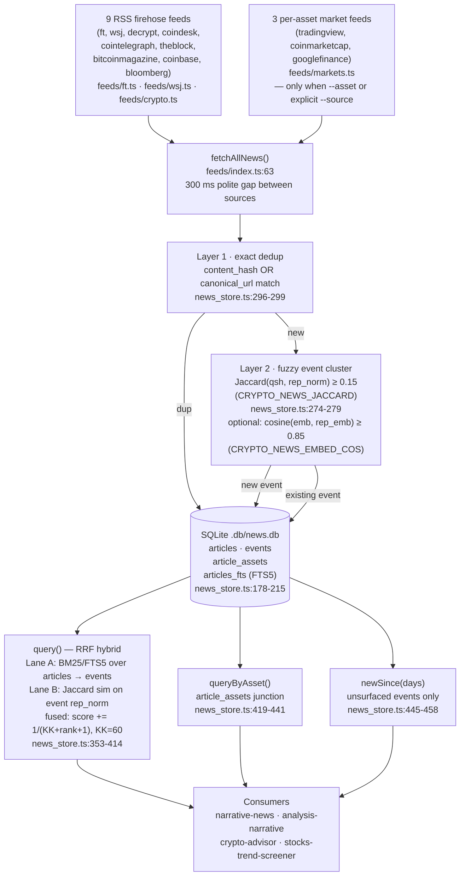

# read-news

Local-first news cache that pulls 9 RSS firehose feeds plus 3 per-asset market sources, deduplicates articles by exact URL/hash, clusters same-story multi-outlet coverage into events via fuzzy Jaccard similarity, tags articles by asset, and serves hybrid BM25+Jaccard+recency retrieval via Reciprocal Rank Fusion. Zero runtime deps: Bun + TypeScript + `bun:sqlite` (no npm packages). Educational tooling — see `SKILL.md` for agent-facing usage.

## Architecture

## Feed registry

| Source | Kind | Endpoint / URL | Browser? | Asset tagging | Paywall |
|---|---|---|---|---|---|
| `ft` | firehose | `https://www.ft.com/<section>?format=rss` | No | none | teaser or `[UNAVAILABLE - paywall]` (ft.ts:126) |
| `wsj` | firehose | `https://feeds.a.dj.com/rss/<feed>.xml` | No | none | teaser or `[UNAVAILABLE - paywall]` (wsj.ts:143) |
| `decrypt` | firehose | `https://decrypt.co/feed` | No | none | full body in `content:encoded` |
| `coindesk` | firehose | `https://www.coindesk.com/arc/outboundfeeds/rss/` | No | none | full body in `content:encoded` |
| `cointelegraph` | firehose | `https://cointelegraph.com/rss` | No | none | full body in `content:encoded` |
| `theblock` | firehose | `https://www.theblock.co/rss.xml` | No | none | summary only |
| `bitcoinmagazine` | firehose | `https://bitcoinmagazine.com/feed` | No | none | full body in `content:encoded` |
| `coinbase` | firehose | Google News proxy (direct site is Cloudflare-gated) | No | none | summary only |
| `bloomberg` | firehose | `https://www.bloomberg.com/feed/podcast/etf-report.xml` (podcast; often 403) | No | none | summary only |
| `tradingview` | per-asset | `https://news-headlines.tradingview.com/v2/headlines?symbol=<sym>` + `/v3/story?id=` | No | `relatedSymbols` → `tvSymbolToAsset()` (markets.ts:36) | no paywall |
| `coinmarketcap` | per-asset | `/data-api/v3/cryptocurrency/detail/lite?slug=` → `/content/v3/news?coins=<id>` | No | explicit asset from query (markets.ts:56) | no paywall |
| `googlefinance` | per-asset | `https://www.google.com/finance/quote/<sym>` HTML scrape | No | ticker from symbol arg (markets.ts:61) | filters to known news domains only |

## Storage & dedup

**Schema** (news_store.ts:178–215):
- `events` — one row per clustered story: `event_cluster_id`, `rep_simhash`, `rep_norm` (normalized text of representative article), `rep_embedding` (optional JSON float array), `title`, `first_seen`, `last_updated`, `sources` (JSON array), `source_count`, `materiality`, `priced_in`, `surfaced_to_panel_on`
- `articles` — raw articles: `event_id` FK → events, `canonical_url`, `content_hash`, `simhash`, `assets` (JSON), indexed on `canonical_url` and `content_hash`
- `article_assets` — junction: `(article_id, asset)` with indexes on both columns (news_store.ts:204–209)
- `articles_fts` — FTS5 virtual table over `(title, summary)`, content-rowid linked to `articles.id`, populated by `art_ai` INSERT trigger (news_store.ts:210–214)

**Layer 1 — exact dedup** (`ingest()`, news_store.ts:296–299): rejects any article whose `content_hash` or non-empty `canonical_url` already exists. Returns `duplicate++`, skips.

**Layer 2 — event clustering** (`findEvent()`, news_store.ts:261–280): computes word+bigram shingles (`JAC_NGRAM=2`) and Jaccard similarity against every event's `rep_norm`. Default threshold `DEFAULT_JACCARD = 0.15` (news_store.ts:17), overridden by `CRYPTO_NEWS_JACCARD`. If an embedding command is set, cosine ≥ `CRYPTO_NEWS_EMBED_COS` (default `0.85`, news_store.ts:263) short-circuits to an immediate cluster match.

Dedup unit behavior (news_store.test.ts:280, 369):
- Single article + URL-dupe → `{ new: 1, duplicate: 1, events_touched: 0 }` (L1 exact-dup)
- 3 similar articles (same event) → `{ new: 3, duplicate: 0, events_touched: 2 }`, 1 event with `source_count: 3` (L2 cluster)

## Retrieval

**`query(db, q, {days?, k?})`** (news_store.ts:353–414) — RRF hybrid:
- Lane A: `articles_fts MATCH ?` BM25 → deduplicated event IDs in BM25 order
- Lane B: shingle-Jaccard rank of all events against normalized query
- Fusion: `score[eid] += 1 / (KK + rank + 1)` where `KK = 60` (news_store.ts:385), sorted descending, capped at `k` (default 15), filtered by `last_updated >= now − days`

**`queryByAsset(db, asset, {days?, k?})`** (news_store.ts:419–441): joins `article_assets` → `articles` → `events` for the given ticker symbol; returns events ordered by `last_updated DESC`.

**`newSince(db, days)`** (news_store.ts:445–458): returns events where `surfaced_to_panel_on IS NULL` and `first_seen` or `last_updated` within the window. `markSurfaced()` stamps the date to prevent re-alerting (news_store.ts:462–476).

**Optional dense vectors**: set `CRYPTO_NEWS_EMBED_CMD` to a shell command that reads text from stdin and prints a JSON float array to stdout. When set, `embed()` (news_store.ts:149–163) is called on ingest and `findEvent()` uses cosine similarity as a fast-path cluster check before Jaccard.

## CLI

**`bun scripts/read_news.ts [flags]`** (read_news.ts)

| Flag | Purpose | Default |
|---|---|---|
| `--db <path>` | SQLite DB path (overrides `CRYPTO_NEWS_DB`) | `.db/news.db` |
| `--days <n>` | Recency window for result filtering | `3` |
| `--k <n>` | Max events returned | `15` |
| `--query <str>` | RRF hybrid text query → `query()` | — (uses `newSince` if absent) |
| `--source <csv>` | Comma-separated source names to fetch | all `NEWS_FEEDS` |
| `--asset <SYM>` | Also fetches TradingView + CMC for symbol; routes to `queryByAsset()` | — |

Output JSON: `{ fetched, feeds_ok, unavailable, events }`.

### Environment variables

| Variable | Purpose | Default |
|---|---|---|
| `CRYPTO_NEWS_DB` | SQLite DB path | `.db/news.db` (news_store.ts:15, read_news.ts:60) |
| `CRYPTO_NEWS_EMBED_CMD` | Shell command: stdin=text → stdout=JSON float array | _(unset — embeddings disabled)_ (news_store.ts:150) |
| `CRYPTO_NEWS_JACCARD` | Jaccard similarity threshold for event clustering | `0.15` (news_store.ts:17,264) |
| `CRYPTO_NEWS_EMBED_COS` | Cosine similarity threshold for dense-vector cluster match | `0.85` (news_store.ts:263) |

## Adding a feed

1. **Write fetcher** `scripts/feeds/<name>.ts` returning `Article[]` (types.ts:10). Required fields: `source`, `url`, `title`, `summary`, `body` (null if unavailable), `published_at` (ISO), `lang`, `tags`, `assets`. Never fabricate body; emit `[UNAVAILABLE - paywall]` in `summary` when no teaser exists.
2. **Register in `feeds/index.ts`**: firehose feeds go in `NEWS_FEEDS` (index.ts:30) and get a `fetchCryptoFeed`-style branch in `fetchAllNews`. Per-asset feeds go in `MARKET_SOURCES` and require an asset loop. Firehose = global macro/crypto; per-asset = fetched once per symbol per run.
3. **Add `<name>.test.ts`** alongside the fetcher.
4. **Keep golden-parity tests green** — `news_store.test.ts:768` defines the real gate: `GOLDEN_INGEST = { new: 15, duplicate: 1, events_touched: 2 }`. This reproduces the retired Python `news_store.py`'s exact dedup counts over a frozen parity fixture. The snapshot also covers `GOLDEN_NEW_SINCE_TITLES` (13 titles) and `GOLDEN_QUERY_TOP5` (lines 769–790). Additive schema changes must not alter any of these frozen values.

## Consumers

- **`narrative-news`** — primary crypto panel gather seat; calls `read_news.ts` and emits the new/updated events for the consolidated brief (narrative-news/SKILL.md:18)
- **`analysis-narrative`** — interpretation layer; runs `read_news.ts` first as single entry point for all news sources, then classifies events PRICED_IN vs ACTIONABLE_CONTEXT (analysis-narrative/SKILL.md:65)
- **`crypto-advisor`** — cites feed-script records (FT/WSJ/read_news.ts) as source-of-truth; hard rule against fabricating headlines (crypto-advisor/SKILL.md:170)
- **`stocks-trend-screener`** — uses `read_news.ts` for a deterministic firm-wide macro feed (stocks-trend-screener/SKILL.md:126)

## Layout

| Path | What |
|---|---|
| `SKILL.md` | Agent-facing usage: commands, flags, fallback paths, hard rules |
| `README.md` | This file — maintainer architecture reference |
| `scripts/news_store.ts` | Storage engine: schema, `ingest`, `query`, `queryByAsset`, `newSince`, `markSurfaced`, SimHash, Jaccard, RRF |
| `scripts/read_news.ts` | CLI entry: arg parsing, `runReadNews`, wires fetchAllNews → ingest → query |
| `scripts/types.ts` | `Article` type, `parseRSS`, `stripHtml`, `toISO`, `fetchWaybackBody` |
| `scripts/feeds/index.ts` | Feed registry: `NEWS_FEEDS`, `fetchAllNews`, source dispatch |
| `scripts/feeds/crypto.ts` | 7 crypto RSS sources (`CRYPTO_FEED_URLS`) |
| `scripts/feeds/ft.ts` | FT section RSS fetcher; paywall-honest |
| `scripts/feeds/wsj.ts` | WSJ RSS fetcher; paywall-honest |
| `scripts/feeds/markets.ts` | TradingView, CoinMarketCap, Google Finance per-asset fetchers |
| `scripts/feeds/*.test.ts` | Per-fetcher unit tests |
| `scripts/news_store.test.ts` | Storage unit tests incl. golden-parity ingest counts |
| `scripts/read_news.test.ts` | CLI integration test |
