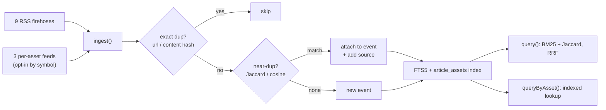

# Deduplicating and clustering news from 12 sources in one SQLite file

We pull financial news from 12 sources — newswires, crypto outlets, and a few
per-asset feeds. The same story shows up everywhere. A Kraken-buys-Aave headline
arrives from CoinDesk, The Block, CoinMarketCap, and TradingView within an hour,
each with a slightly different title. If you store every article as its own row,
your "latest news" list is five copies of one event and your reader learns
nothing new on items two through five.

We wanted three things from the store, and we wanted them in a single local file
with no external service and no API keys:

1. **One row per real-world event**, with the list of sources that reported it.
2. **"What's the news on AAVE?"** answered in one indexed lookup.
3. **Full-text search** that tolerates reworded headlines.

This is how the store works. Every mechanism below is in
`.agents/skills/read-news/scripts/news_store.ts` unless noted. The whole thing is
Bun + `bun:sqlite` + `node:crypto`. Zero npm dependencies.

## The data shape: events and articles

Two tables carry the model (`news_store.ts:178`):

- `articles` — one row per fetched item: source, url, title, summary, timestamps.
- `events` — one row per **clustered story**: a representative title, `first_seen`,
  `last_updated`, and a JSON `sources` array with a `source_count`.

Every article points at exactly one event (`articles.event_id`). An event is the
thing you show a human or feed to an agent; the articles are its evidence. When
the Kraken story arrives four times, you get one event with
`sources: ["coindesk","theblock","coinmarketcap","tradingview"]` and
`source_count: 4`.

The interesting part is deciding, for each incoming article, whether it joins an
existing event or starts a new one. We do it in two layers: cheap-and-exact
first, then fuzzy.

## Layer 1: exact dedup

Before any similarity math, we throw away articles we've literally seen. Two keys
(`news_store.ts:292`):

```ts
const curl  = canonicalUrl(rec.url);        // drop #fragments, utm_*, gclid, trailing /
const chash = contentHash(title, summary);  // sha256 over normalized title+summary

const exists = db.prepare(
  "SELECT 1 FROM articles WHERE content_hash=? OR (canonical_url<>'' AND canonical_url=?) LIMIT 1",
).get(chash, curl);
if (exists) { dup++; continue; }
```

`canonicalUrl` strips tracking junk so the same article shared with five
different `utm_source` values collapses to one URL. `contentHash` hashes the
*normalized* text, not the raw string, so trivial punctuation or casing
differences still hash equal. Both columns are indexed (`idx_art_canon`,
`idx_art_hash`), so this is an index hit, not a scan.

Normalization is deliberately aggressive (`news_store.ts:55`):

```ts
s = s.normalize("NFKC").toLowerCase();
s = s.replace(/https?:\/\/\S+/g, " ");
s = s.replace(/[^a-z0-9$ ]+/g, " ");   // keep "$" so cashtags like $BTC survive
s = s.replace(/\s+/g, " ").trim();
```

We keep `$` on purpose — `$BTC` and `$AAVE` are signal in this domain.

## Layer 2: near-duplicate clustering

Exact dedup catches re-shares. It does **not** catch "Aave CEO denies sale" vs
"Aave founder Kulechov says AAVE isn't for sale" — same event, different words.
For that we measure set overlap.

We turn the normalized text into **shingles** (the unigrams plus 2-word
sequences) and compare two articles with the **Jaccard index** — the size of the
intersection over the size of the union (`news_store.ts:139`):

```ts
export function jaccard(a: Set<string>, b: Set<string>): number {
  let inter = 0;
  for (const x of a) if (b.has(x)) inter++;
  const union = a.size + b.size - inter;
  return union > 0 ? inter / union : 0;
}
```

On ingest, `findEvent()` walks existing events and returns the best match above a
threshold (default `0.15`, tunable via `CRYPTO_NEWS_JACCARD`). If an embedding
backend is configured it checks cosine similarity first and short-circuits at
`0.85` (`news_store.ts:261`):

```ts
for (const r of rows) {
  if (emb !== null && r.rep_embedding) {
    const repEmb = JSON.parse(r.rep_embedding);
    if (cosine(emb, repEmb) >= cosThr) return r;     // 0.85
  }
  const j = jaccard(qsh, shingles(r.rep_norm));
  if (j >= jacThr && (best === null || j > best[1])) best = [r, j];
}
```

Embeddings are **optional and pluggable**. `embed()` shells out to whatever
command you put in `CRYPTO_NEWS_EMBED_CMD` and reads a JSON vector back from
stdout (`news_store.ts:149`). No command set → it returns `null` and the store
runs on Jaccard alone. That keeps the default install free of any ML dependency
while leaving a clean seam for a better matcher.

Match found → attach the article, add its source to the event's `sources` array,
bump `last_updated`. No match → insert a new event seeded with this article
(`news_store.ts:308`).

## Search: BM25 and Jaccard, fused with RRF

For search we don't want to choose between keyword matching and fuzzy matching,
so we run both and fuse the rankings.

- **Rank A** is SQLite's FTS5 over `title + summary`, ordered by **BM25** (the
  standard TF-IDF-style relevance score). FTS5 is a built-in virtual table kept
  in sync by an `AFTER INSERT` trigger (`news_store.ts:210`) — no separate search
  engine.
- **Rank B** is the Jaccard shingle similarity of the query against each event's
  representative text.

We combine them with **Reciprocal Rank Fusion (RRF)**: each list contributes
`1 / (K + rank)` to an item's score, with `K = 60` (`news_store.ts:384`):

```ts
const KK = 60;
for (let rank = 0; rank < bm25Events.length; rank++)
  score[eid] += 1 / (KK + rank + 1);
for (let rank = 0; rank < simRank.length; rank++)
  score[eid] += 1 / (KK + rank + 1);
```

RRF needs no score normalization between the two systems — it only uses
positions — which is exactly why it's the easy, robust choice when you're fusing
a relevance score with a similarity score that live on different scales.

## Per-asset lookup: a junction table, not a scan

Agents ask "give me everything on AAVE." Scanning every article's text for a
ticker on each call is wasteful, so we index it.

Each article carries a normalized `assets: string[]` (uppercased tickers, kept
separate from the freeform RSS `tags`). On ingest we write one row per asset into
a junction table (`news_store.ts:204`, `:344`):

```sql
CREATE TABLE article_assets (article_id INTEGER, asset TEXT);
CREATE INDEX idx_aa_asset   ON article_assets(asset);
CREATE INDEX idx_aa_article ON article_assets(article_id);
```

`queryByAsset()` is then a single indexed lookup that returns clustered events,
newest first (`news_store.ts:419`):

```sql
SELECT e.* FROM events e WHERE e.event_cluster_id IN (
  SELECT DISTINCT a.event_id FROM article_assets aa
  JOIN articles a ON a.id = aa.article_id WHERE aa.asset = ?
) ORDER BY e.last_updated DESC LIMIT ?;
```

Because the index is on the normalized symbol and we uppercase the query, lookups
are case-insensitive by construction — `aave`, `AAVE`, and `Aave` all hit.

Where do the asset tags come from? Two of our per-asset sources hand them to us
for free, which is the main reason we added them.

## The 12 sources: a firehose plus three per-asset feeds

Nine sources are plain RSS firehoses — fetch the feed, take what's there:
`ft`, `wsj`, `decrypt`, `coindesk`, `cointelegraph`, `theblock`,
`bitcoinmagazine`, `coinbase`, `bloomberg` (`feeds/index.ts:30`).

Three more are **per-asset** — you query them by symbol, and they return news
already attributed to that asset (`feeds/markets.ts`):

| Source | How we read it | Keyless? | Asset tags | AI summary |
|---|---|---|---|---|
| **TradingView** | JSON `news-headlines.tradingview.com/v2/headlines?symbol=EX:SYM`, plus `v3/story?id=` for the AI "Key facts" digest | yes | `relatedSymbols[]` | yes — we flatten the story AST into the summary |
| **CoinMarketCap** | JSON `content/v3/news?coins=<numericId>` (resolve id via `detail/lite?slug=`) | yes | query is by coin | partial — `meta.subtitle` |
| **Google Finance** | no clean API — headlines parsed from the server-rendered HTML | yes | query is by ticker | no — the on-page AI summary is client-rendered |

TradingView's per-story endpoint returns an abstract syntax tree; we walk it and
join the bullet points into a plain-text summary (`flattenTvAst`,
`markets.ts:18`). Google Finance has no JSON we could find, but the headlines sit
in the HTML as `<a href><div>title</div></a>`. The class names are obfuscated and
rotate, so we match on **structure, not class** (`parseGoogleFinanceHtml`). The
one thing we deliberately don't scrape is Google's on-page AI summary — it's
rendered by JavaScript, so pulling it would mean shipping a headless browser, and
that breaks the zero-dependency rule for a single field. If we ever need it, it
goes behind a separate browser-driving path, not into the core fetcher.

Because each per-asset source costs one request **per asset**, they are kept out
of the default firehose and fetched only when you ask for a symbol
(`feeds/index.ts:33`). The everyday run stays nine cheap feed pulls; the
per-asset cost is opt-in.



## Trade-offs we made on purpose

**`findEvent()` scans every event on each ingest.** Clustering does
`SELECT * FROM events` and compares shingles in a loop (`news_store.ts:262`).
That's O(events) per article, O(events × batch) per run. It's fine at thousands
of events on a laptop and it keeps the code to a few lines. At millions you'd
want a locality-sensitive-hash or approximate-nearest-neighbor index — which is
why every row already stores a `simhash` we can switch to a Hamming-distance
bucket later. Today the match key is Jaccard (plus optional embeddings); the
SimHash column is computed and stored but the live matcher doesn't read it yet.

**The Jaccard threshold is loose (0.15).** It favors merging over splitting,
because for a news digest one combined card with four sources beats four
near-identical cards. The cost is real: in a live run the *same* Kulechov
headline produced two events — one from The Block + CoinMarketCap, one from
TradingView — because our cluster key is `normalize(title + summary)` and
TradingView's AI-generated summary diverged far enough from the RSS teaser to
fall under the threshold. If you tighten the threshold you split more; if you key
on title alone you over-merge unrelated stories that share a headline pattern.
There's no free setting here, only a chosen failure mode.

**Embeddings are off by default.** The pure-Jaccard path has no model, no Python,
no network. You opt into something smarter with one env var. We'd rather ship a
boring matcher that always runs than a clever one that needs a GPU to boot.

## Using it

```bash
# daily firehose — fetch, dedup, cluster, list new events
bun .agents/skills/read-news/scripts/read_news.ts --days 2

# everything on one asset (also pulls TradingView + CMC for that symbol)
bun .agents/skills/read-news/scripts/read_news.ts --asset AAVE --days 7

# search the clustered store
bun .agents/skills/read-news/scripts/news_store.ts query --q "etf outflows" --days 7

# per-asset lookup straight from the store
bun .agents/skills/read-news/scripts/news_store.ts by-asset --asset BTC
```

A live `--asset AAVE` run fetches a few hundred articles across the feeds,
collapses them into events, and returns AAVE-only stories with CoinMarketCap and
TradingView clustered into the same events as CoinDesk and The Block — which is
the whole point: one event, every source that carried it.

## Where this fits

This is the news layer of an agentic markets stack we're building at
**Quantarena** ([quantarena.xyz](https://quantarena.xyz)). The analysts that
reason over headlines don't want a feed; they want *events* — deduplicated,
clustered, attributed to a list of sources, and queryable by the asset they're
looking at. Keeping that in one dependency-free SQLite file means the same store
runs in a test, on a laptop, and in the agent loop without standing up a search
cluster. Boring on purpose, because the interesting work is upstream of it.
